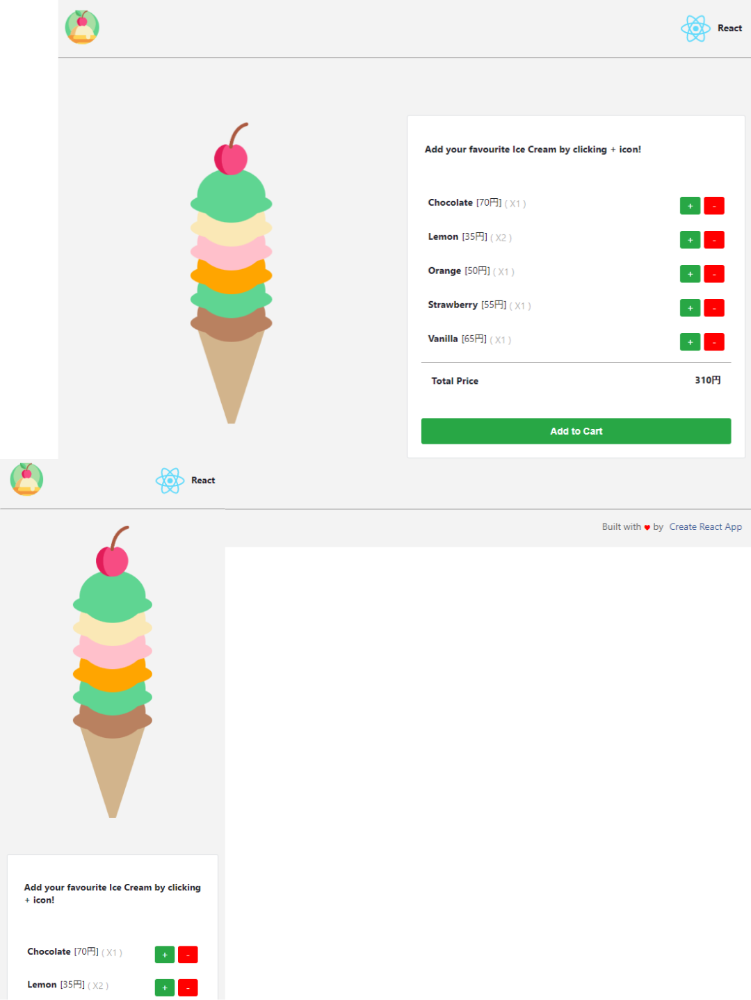

  
  
  
  
  

 

  

<h2  id="header" align="center" >
  <a  href="https://react-icecream.netlify.app" >Prashanta | Beautiful Ice Cream Builder UI</a>
</h2>

  

 

## Built With

This is a beautiful <a href="https://react-icecream.netlify.app" target="_blank">ice cream</a> buider ui.
You can select your favourite icecream to order and a beautiful dynamic icecream will be build according to your choice.
It's a self sedevloped personal project created using create-react-app with react.js.

This app was built using these technologies.

- React.js
- CSS3
- VsCode
- Git

## Features

**📖 Single-Page Layout**

**🎨 Beautiful Dynamic Icecream Layout.**

**🎨Features I have used**
  
- Make small components of every part of o page 
- Functional Component 
- Props rendering
- Import files
- Arrow functions
- State management using hook
- Manage code with version control(git)
- Integrate eslint with prettier for auto formatting 
- Use additional yarn scripts for creating beautiful UI 
- Finally deploy it on netlify.

**📱 Fully Responsive**

 
  
## Show your support
  
Give a me ⭐ if you like this website!
